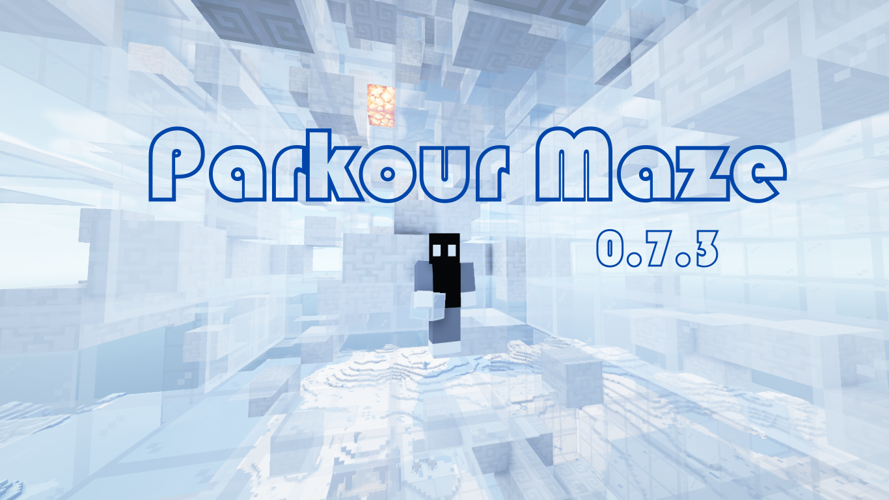

# parkour_maze_creator_in_minecraft

## Info
It's a datapack that can easily construct parkour-maze for you. You may use it in your map project, play with your friends, or just have fun for yourself~ ;)
(It almost only include functions, no loot table, no recipes, just commands.)

Show instructions: 

**/function parkour_maze:instructions**

(Video is recommended to understand how to actually use the datapack)

Youtube: https://www.youtube.com/watch?v=Y8vSgmc2Uus

Bilibili: https://www.bilibili.com/video/BV1g44y1c79h

If you like this datapack, don't forget to leave comment below! XD
Have fun!

## Links

Firstly publicated at mcbbs (China): https://www.mcbbs.net/thread-1229566-1-1.html

My twitter: https://twitter.com/lin_yangqi

My bilibili page: https://space.bilibili.com/24599280

P.MC page:  https://www.planetminecraft.com/data-pack/parkour-maze-creator-0-7-2/
